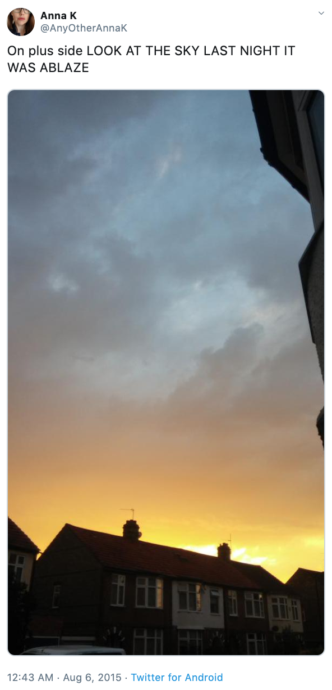

## Machine Learning Engineer Nanodegree
# Real or Not? NLP with Disaster Tweets Challenge
## Capstone Project
Akihiro Nomura  
January 28th, 2020

## I. Definition

### Project Overview

Twitter has become an important communication channel in times of emergency. The ubiquitousness of smartphones enables people to announce an emergency they’re observing in real-time. Because of this, more agencies are interested in programatically monitoring Twitter (i.e. disaster relief organizations and news agencies).

This project was inspired by Kaggle competition[^1]
[^1]: https://www.kaggle.com/c/nlp-getting-started/overview

### Problem Statement



Unfortunately, It’s not always clear whether a person’s words are actually announcing a disaster. Please see the right example. The author explicitly uses the word “ABLAZE” but means it metaphorically. This is clear to a human right away, especially with the visual aid. But it’s less clear to a machine.

The goal is to build a machine learning model that predicts which tweets are about real disasters and which one’s aren’t. So, I'll try to solve a kind of natural language processing (NLP) problem.

Tweet source: https://twitter.com/AnyOtherAnnaK/status/629195955506708480

<br />


### Metrics

A model in this project is evaluated using F1-score between the predicted and expected answers. F1-score, a measure of a test's accuracy, can be interpreted as a weighted average of the precision and recall. F1 score is good choice when target distribution is unbalanced or skewed towards one classification over another. F1-score is calculated as follows:

$$
    F1 = 2 * \frac{precision * recall}{precision + recall} = \frac{2TP}{2TP + FP + FN}
$$

where:

$$
    precision = \frac{TP}{TP + FP}, \quad 
    recall = \frac{TP}{TP + FN}
$$

TP, FN and FP represent the number of true positives, false negatives and false positives, respectively.


## II. Analysis

### Data Exploration

For this project, I can use a dataset of 10,000 tweets that were hand classified. Each entry has the following information. You can download the data from this link[^2].
[^2]: https://www.kaggle.com/c/nlp-getting-started/data

#### Files:
- train.csv (7613 rows) : the trainig dataset
- test.csv (3263 rows) : the test dataset
- sample_submission.csv (3263 rows) : a sample submission file

#### Columns:
- id - a unique identifier for each tweet
- text - the text of the tweet
- location - the location the tweet was sent from (may be blank)
- keyword - a particular keyword from the tweet (may be blank)
- target - this denotes whether a tweet is about a real disaster (1) or not (0)

The first 5 row of train data and test data are as follows. I predicted whether a given tweet was about a real disaster or not. If so, predict a `1`. If not, predict a `0`.

train.csv:  


test.csv:  


#### Observations:
- In train and test data, 'keyword' and 'location' have missing values, NaN. About 0.8% of the keyword values are NaN, about 33% of the location values are NaN. There is not much difference in the ratio of these values ​​in train and test data.
- About 43% of tweets in the train data are about real disaster.
- There is no difference in the number of characters and words in tweet in disaster/non-disaster.
- Depending on the values of keyword and location, it may be possible to determine whether each tweet is about a real disaster or not. Top 5 values of keyword and location are below.

|  Keyword  |  Top 5 values  |
| ---- | ---- |
|  About real disaster in train data  |  outbreak, derailment, wreckage, debris, oil%20spill |
|  About non-disaster in train data  |  body%20bags, harm, armageddon, deluge, wrecked |

|  Location  |  Top 5 values  |
| ---- | ---- |
|  About real disaster in train data  |  USA, United States, Nigeria, India, Mumbai |
|  About non-disaster in train data  |  New York, USA, London, United States, Los Angeles, CA |

- There is no information on how keywords of tweets are set.

<br />
<br />
<br />
<br />
<br />

### Exploratory Visualization

I would like to show you 10 graphs of the results of my investigation on each data.

#### Fig. 1 : Target (0 or 1) count and percentage
We can observe that about 43% of tweets in the dataframe is about real disaster.

<div align="center">

</div>

#### Fig. 2: Number of characters in tweets for each target (0 ro 1)
The distribution of both seems to be almost same. 120 to 140 characters in a tweet are the most common among both.

<div align="center">

</div>

<br />
<br />
<br />

#### Fig. 3: Number of words in tweets for each target (0 ro 1)

<div align="center">

</div>

#### Fig. 4: Each unique keyword count in training data

<div align="center">

</div>

#### Fig. 5: Top 20 location in training data
Most of the tweets are from USA, London, Canada.

<div align="center">

</div>

#### Fig. 6: Each unique keyword count in test data

<div align="center">

</div>

#### Fig. 7: Top 20 location count in test data

<div align="center">

</div>

#### Fig. 8: Word cloud, a kind of word frequency, in tweets about real disaster

WordCloud[^4] is visual representation of words that give greater prominence to words that appear more frequently.
[^4]: http://amueller.github.io/word_cloud/index.html

<div align="center">

</div>

#### Fig. 9: Word cloud in tweets about non-disaster

<div align="center">

</div>

#### Fig. 10: Word cloud in tweets of test data

<div align="center">

</div>


### Algorithms and Techniques

I chose to use **XGBoost**. XGBoost stands for extreme gradient boosting, which is an implementation of gradient boosting with several additional features focused on performance and speed. With careful parameter tuning, we can train highly accurate models. It has known to perform best for structured dataset.

By the way, gradient boosting is a method that goes through cycles to iteratively add models into an ensemble. According to this link[^3], details about gradient boosting are as follows.
[^3]: https://www.kaggle.com/alexisbcook/xgboost

> It begins by initializing the ensemble with a single model, whose predictions can be pretty naive. (Even if its predictions are wildly inaccurate, subsequent additions to the ensemble will address those errors.)
>Then, we start the cycle:
>- First, we use the current ensemble to generate predictions for each observation in the dataset. To make a prediction, we add the predictions from all models in the ensemble.
>- These predictions are used to calculate a loss function (like mean squared error, for instance).
>- Then, we use the loss function to fit a new model that will be added to the ensemble. Specifically, we determine model parameters so that adding this new model to the ensemble will reduce the loss. (Side note: >- The "gradient" in "gradient boosting" refers to the fact that we'll use gradient descent on the loss function to determine the parameters in this new model.)
>- Finally, we add the new model to ensemble, and ...
>- ... repeat!  
>


Also, I used **CountVectorizer**[^5]. CountVectorizer provides a simple way to both tokenize a collection of text documents and build a vocabulary of known words, but also to encode new documents using that vocabulary. So, I created Bag-of-Words model[^6]. We cannot work with text directly when using machine learning algorithms. We need to convert the text to numbers. We may want to perform classification of documents, so each document is an “input” and a class label is the “output” for our predictive algorithm. Algorithms take vectors of numbers as input, therefore we need to convert documents to fixed-length vectors of numbers. The Bag-of-Words model is simple in that it throws away all of the order information in the words and focuses on the occurrence of words in a document.

[^5]: https://scikit-learn.org/stable/modules/generated/sklearn.feature_extraction.text.CountVectorizer.html
[^6]: https://en.wikipedia.org/wiki/Bag-of-words_model


### Benchmark

On Public Leaderboard of this kaggle competition, score of "Getting Started Notebook Benchmark" is 0.77505. This is mean F1-score which is calculated with approximately 30% of the test data. So, I used this score as the benchmark for measuring performance of the machine learning model that predicts which tweets are about real disasters or not.


## III. Methodology

### Data Preprocessing

If we check tweets in training data and test data, we can see some expressions like @, # or slang words as shown below. In many cases, texts such as following have to be cleaned before we go onto modelling, so that we use them as input to a NLP model.

```
.@NorwayMFA #Bahrain police had previously died in a road accident they were not killed by explosion https://t.co/gFJfgTodad
```

#### Feature Engineering (Text Cleaning)

As mentioned earlier, I did pre-processing of the text contained within the training and test data. The processing applied here are some of the standard NLP steps that one would implement in a text based problem, consisting of:

- Remove url
- Remove html
- Remove emoji[^7]
- Remove punctuation
- Unslang[^8](Converts text like "OMG" into "Oh my God")
- Tokenization
- Remove stopwords
- Stemming

[^7]: https://gist.github.com/slowkow/7a7f61f495e3dbb7e3d767f97bd7304b

[^8]: https://github.com/rishabhverma17/sms_slang_translator/blob/master/slang.txt

By taking these steps, for example, the following processing is performed for each tweet.

**Before:**
```
.@NorwayMFA #Bahrain police had previously died in a road accident they were not killed by explosion https://t.co/gFJfgTodad
```
**After:**
```
norwaymfa bahrain polic previous die road accid kill explos 
```

<br />
<br />
<br />
<br />

### Implementation

The software and libraries which I used are below:

**Programming language**: Python 3.6  
**Library**: Pandas, Matplotlibs, Numpy, seaborn, plotly, wordcloud, re, string, NLTK (Natural Language Toolkit), Scikit-learn, XGBoost  


I used only cleand twwet texts as inputs of the machine learning model. I mean that I didn't use 'keyword' and 'location' of each tweet. As mentioned earlier, 'location' and 'keyword' appear to have a strong correlation with target (0 or 1). This is an extreme example, but if 'location' is used as input and location of a tweet is 'New York', the machine learning model could determine almost all tweets as non-disaster. Also, we have no information on how to get and determine keywords. Therefore, to make a model as generic as possible, I excluded them from the input.

Additionally, I split the training data into training and validation parts with a 70:30 ratio like below and then evaluated before submission to Kaggle competition.

```
X_train, X_valid, y_train, y_valid = train_test_split(X, y, test_size=0.3, random_state=0)
```

The score on Kaggle Public Leaderborad of the untuned model is 0.74437. It is smaller than the benchmark score, 0.77505. So, I had to strengthen this model to beat the benchmark score.


### Refinement

#### Hyperparameter tuning

I decided to tune the hyperparameters manually, not by tools such as hyperopt. That is because, according to course of Coursera, it is more efficient to adjust the hyperparameters manually than to use the tools. the course title is 'How to Win a Data Science Competition: Learn from Top Kagglers'[^9].
[^9]: https://www.coursera.org/learn/competitive-data-science?

About how to tune the hyperparameters of XGBClassifier, I used 'Complete Guide to Parameter Tuning in XGBoost with codes in Python'[^10] as reference.
[^10]: https://www.analyticsvidhya.com/blog/2016/03/complete-guide-parameter-tuning-xgboost-with-codes-python/

The parameters to be adjusted and the search ranges are as follows.

1. max_depth
    - Maximum depth of a tree
    - Search values: [3 - 10]
1. min_child_weight
    - Minimum sum of weights of all observations required in a child
    - Search values: [1 - 5]
1. gamma
    - Minimum loss reduction required to make a split
    - Search values: [0.0 - 0.4]
1. subsample
    - Fraction of observations to be randomly samples for each tree
    - Search values: [0.6 - 1.0]
1. colsample_bytree
    - Fraction of columns to be randomly samples for each tree
    - Search values: [0.6 - 1.0]
1. alpha
    - L1 regularization term on weight
    - Search values: [1e-5, 1e-2, 0.1, 1, 100]
1. eta (learning_rate)
    - Makes the model more robust by shrinking the weights on each step
    - Decrease from 0.1

#### GPU mode

Learning from about 7000 text data with the XGBoost algorithm took a long time often. It was very inefficient. XGBoost supports GPU, therefore I used GPU algorithm. That is, I set `tree_method` parameter to `gpu_hist`.


## IV. Results

### Model Evaluation and Validation

The machine learning model which I created based on the previous steps is as follows:
```
XGBClassifier(base_score=0.5, booster='gbtree', colsample_bylevel=1,
              colsample_bynode=1, colsample_bytree=0.8,
              early_stopping_rounds=50, eval_metric=['auc', 'logloss', 'error'],
              gamma=0.4, learning_rate=0.1, max_delta_step=0, max_depth=10,
              min_child_weight=2, missing=None, n_estimators=2000, n_jobs=1,
              nthread=None, num_round=1000, objective='binary:logistic',
              random_state=0, reg_alpha=1e-05, reg_lambda=1, scale_pos_weight=1,
              seed=None, silent=None, subsample=0.9, tree_method='gpu_hist',
              verbosity=1)
```

<br />

The confusion matrix and the accuracy of the model are below:

// Confusion matrix on validation data
```
y_pred_xgb = xgb_classifir.predict(X_valid)
confusion_matrix(y_valid, y_pred_xgb)
----------------------------------------------
array([[1133,  205],
       [ 269,  677]])
```

// Accuracy score on validation data
```
accuracy_score(y_valid, y_pred_xgb)
----------------------------------------------
0.7924693520140105
```


### Justification

**F1-score on Public Leaderboard of my XGBClassifier model with tuned hyper parameters is 0.77811.** It is greater than the benchmark score, 0.77505. Although the tuned model made no significant improvement over the untuned model, its socre is 0.74437, this result shows that the approach I took was the right direction.


## V. Conclusion

### Free-Form Visualization

I picked 2 tweets from the test data and let the machine learning model determine if those tweets are about real disaster or not, and the results are follows:

```
Birmingham Wholesale Market is ablaze BBC News - Fire breaks out at Birmingham's Wholesale Market http://t.co/irWqCEZWEU
```
-> **Real disaster**

```
@sunkxssedharry will you wear shorts for race ablaze ?
```
-> **Non-disaster (fake tweet!)**

Also, I would like to show you graphs of perfomances of the tuned machine learning model. I judged that the results are not bad in those of the performance indicators.

#### Fig. 11 : ROC curve


#### Fig. 12 : Performance metrics (AUC, Log Loss, Error)


### Reflection

The process of this project can be summarized as follows: 
1. Get dataset from Kaggle
1. Exploratory Data Analysis (EDA)
1. Feature Engineering (Text Cleaninig)
1. Create the XGB model
1. Evaluate the model
1. Tuning the model
1. Reveiw metrics of the model
1. Submit data to Kaggle competition


The most important and time consuming part of the project was text cleaning. Most of the tweets have non formal expressions like some abbreviations or slangs, urls and symbols such as @ or #. In Natural Language Processing, NLP,  it is necessary to convert these expressions so that machine learning algorithms can easily use them as inputs. This process was the most difficult in this project but very interesting for me.


### Improvement

Firstly, I planed to implement a process of correcting each spell to perform better feature engineering. The code was below. However, this process for thousands of texts took too long, I removed this code. If I had a high computing resources, I might have been able to do this process and get a better score.

```
!pip install pyspellchecker

from spellchecker import SpellChecker

spell = SpellChecker()
def correct_spellings(text):
    corrected_text = []
    misspelled_words = spell.unknown(text.split())
    for word in text.split():
        if word in misspelled_words:
            corrected_text.append(spell.correction(word))
        else:
            corrected_text.append(word)
    return " ".join(corrected_text)
```


Also, there are more machine learning algorithms I didn't use in this project. For example, the following ones:

- Neural Network
- Support Vector Machine
- K-Nearest Neighbors
- Gaussian Naive Bayes, and so on...

I think that ensemble learning[^10], combining different machine learning models as above in order to get a more powerful prediction, may result in higher socore.
[^10]: https://en.wikipedia.org/wiki/Ensemble_learning

So, there are plenty of ways for improving scores.

